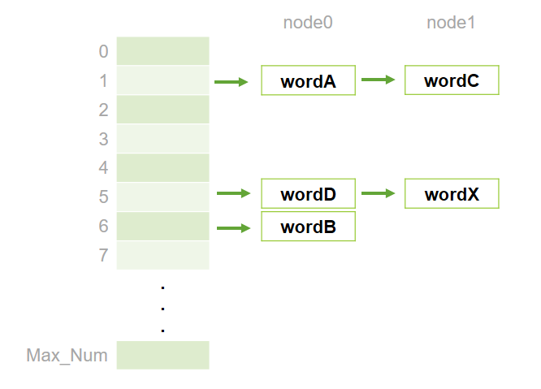
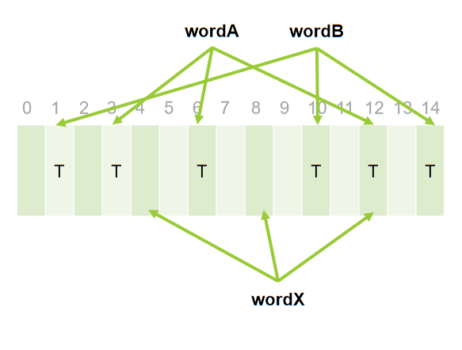

## ADTs_Dictionary
###
Repository for programming C unit coursework.
An implemetation of a dictionary data structure with the format of an Abstract Data type (ADT).
Included codes for two algorithms, Hash map and Bloom filter.

Mark achieved for this unit - 74% (1st)

### Approach 1. Hash map
store each word in Hashmap

#
### Approach 2. Bloom filter

